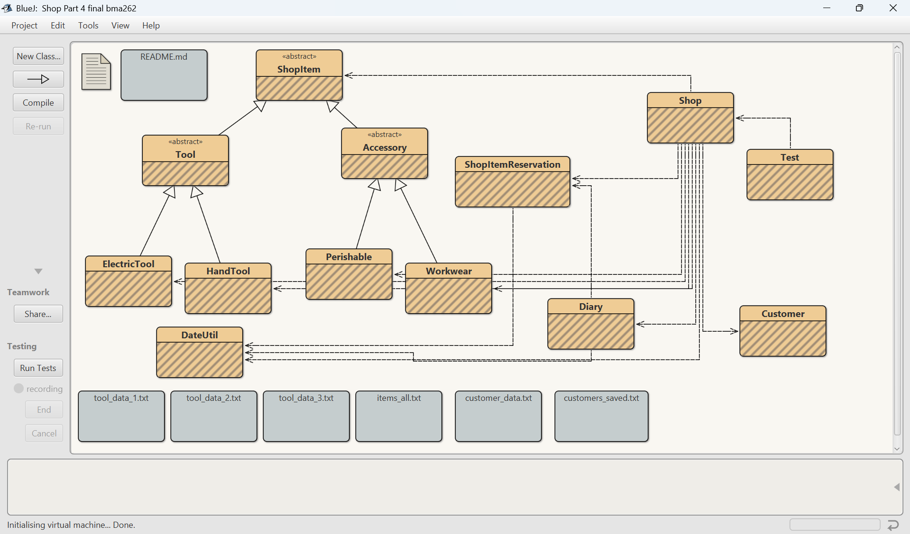
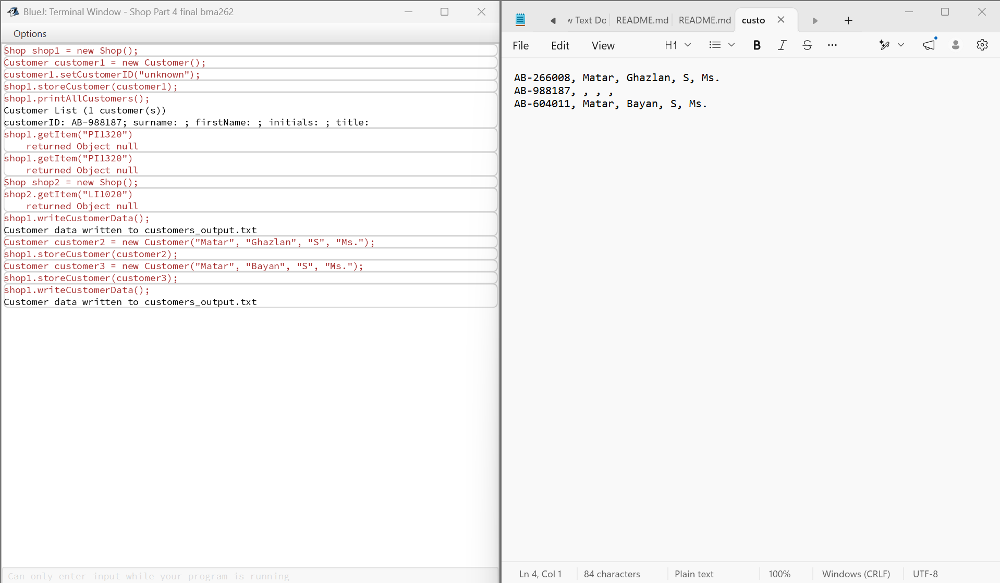

# Tool Hire Shop System 🔧

A Java-based shop management application built in BlueJ, implementing core Object-Oriented Programming principles for a tool hire business.

## Class Structure

- **ShopItem** – Base class for all items

- **Tool** – Extends ShopItem; parent of ElectricTool and HandTool

- **ElectricTool / HandTool** – Specific tool types

- **Perishable / Accessory / Workwear** – Other item categories

- **Customer** – Customer data and management

- **ShopItemReservation** – Handles hiring/reservation logic

- **Diary** – Booking diary with date-based entries

- **DateUtil** – Date handling utilities

- **Shop** – Main class managing the full shop system

## Tech Stack

- Java (OOP)

- BlueJ IDE

## Key Features

- Item cataloguing across multiple categories using class hierarchies

- Customer registration and management

- Tool hiring and reservation system with diary-based scheduling

- Date utility handling for hire periods

- File-based data persistence (txt files)

- Encapsulation, inheritance, and method overloading throughout

## Preview

### Class Diagram

### Sample Output

## How to Run

1. Download and install \[BlueJ](https://www.bluej.org)

2. Open BlueJ → Open Project → select this folder

3. Right-click the `Shop` class → create instance to start

## Built For

Programming module — British University of Bahrain (2026)

